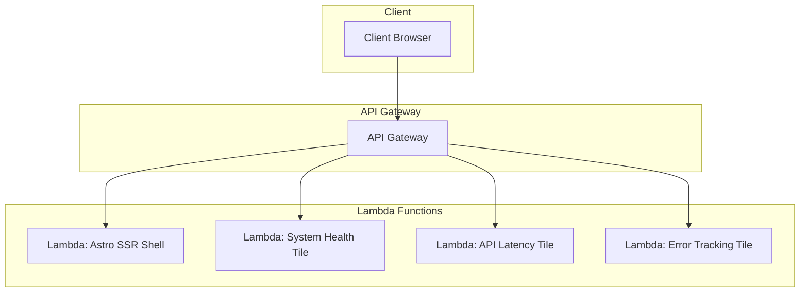

# Observability Dashboard with Astro Server Islands

## Overview

This project is a Proof-of-Concept (PoC) for an **Observability Dashboard** built using:

- **Micro-frontends** for modular UI composition and independent deployment
- **Astro** with **Server Islands** to enable server-side interactivity for specific UI components
- **AWS Lambda** and **API Gateway** to independently deploy and scale server-rendered UI fragments

The primary objective is to validate a modern, composable frontend architecture that supports **independent delivery**, **dynamic UI updates**, and **serverless scalability**, all while providing a responsive and interactive experience for observability use cases.

## Business Context

### The Problem

Traditional observability dashboards often grow into complex monoliths. Updating a single chart or visualization can require redeploying the entire UI, resulting in unnecessary downtime and risks.

Additionally, as teams scale and require domain ownership, it's crucial to support **independent development, testing, and deployment** of specific dashboard components — especially in large organizations where observability spans multiple domains (e.g., infrastructure, backend, application performance, security).

### Goals

This PoC aims to explore whether it's feasible to:

- **Modularize the dashboard** into discrete micro-frontends that can be independently deployed and managed
- **Leverage server-side rendering per component**, selectively re-rendering only what's needed via Astro Server Islands
- **Deploy those server-rendered components serverlessly**, allowing individual scalability and reducing infrastructure overhead

## Architecture

This PoC combines several modern architectural patterns and technologies:

### 1. Micro-Frontends

- Each tile in the dashboard is a **self-contained micro-frontend**
- Micro-frontends are **deployed independently** through AWS Lambda functions
- Each micro-frontend fetches and renders its own data, isolating concerns and deployments

### 2. Astro Server Islands

- **Server Islands** are Astro components that render on the server and hydrate on demand
- Each island is **re-rendered server-side** with fresh data when updated
- This balances the **performance of static delivery** with the **flexibility of SSR**

### 3. Serverless with AWS

- The Astro shell layout is deployed as an **independent Lambda function** (header, footer, layout frame)
- Each dashboard tile is deployed as a **dedicated Lambda function**
- **API Gateway** routes client requests to the appropriate Lambda based on the path

### Architecture Diagram



## Project Structure

```
/
  /app-shell             (Main shell application)
  /island-system-health  (System Health island)
  /island-api-latency    (API Latency island)
  /island-user-activity  (User Activity island)
```

## Implementation Deep Dive

### The App Shell

The app shell serves as the container for all micro-frontend islands. It:

1. Provides the overall layout and navigation
2. Loads island configurations from a central JSON file
3. Fetches each server island from its respective microservice
4. Handles fallbacks when islands are unavailable

### Routing Strategy: App Shell and Islands Cooperation

The architecture employs a collaborative routing strategy where the app shell handles primary routing while delegating secondary navigation to each island:

#### App Shell Responsibility: First-Level Routing

The app shell manages top-level navigation through dynamic routes:

```javascript
// app-shell/src/pages/[island]/[...path].astro
---
import Layout from '../../layouts/Layout.astro';
import { getIslandConfig } from '../../utils/islandConfig';

// Extract island and path parameters
const { island, path } = Astro.params;
const pathSegments = path ? path.split('/') : [];

// Find the matching island configuration
const islandConfig = getIslandConfig(island);

if (!islandConfig) {
  return Astro.redirect('/');
}

// Construct the endpoint URL using the island's baseEndpoint
let endpointUrl = `${islandConfig.baseEndpoint}/${islandConfig.id}`;

// Add path segments if they exist
if (pathSegments.length > 0) {
  endpointUrl += `/${pathSegments.join('/')}`;
}

// Now fetch from the constructed endpoint URL...
---
```

This approach allows the app shell to:
1. Route all `/[island-name]/...` requests to the appropriate island service
2. Pass through all path parameters to the island's own routing system
3. Maintain a clean URL structure that reflects the logical organization

#### Island Responsibility: Second-Level Routing

Each island implements its own internal file-based routing for sub-pages:

```
/island-system-health/src/pages/
├── system-health.astro       # Main entry point
└── system-health/
    ├── index.astro           # Default view
    └── details.astro         # Details page
```

When a request comes in for `/system-health/details`, the app shell routes this to the island's endpoint with the appropriate path, and the island's own routing system handles displaying the correct page.

This decoupled approach provides several benefits:

1. **Independent Evolution**: Islands can introduce new routes without requiring app shell changes
2. **Clear Ownership Boundaries**: Each team owns their complete routing structure
3. **Simplified Maintenance**: URL structures can evolve independently per domain
4. **SEO Friendly**: Clean URLs that map logically to content

Each island implements a dual-mode rendering capability that checks if it's being accessed directly or embedded within the app shell:

```javascript
// Within each island page
const isDirectAccess = !Astro.request.headers.get('HX-Request') && 
                       !Astro.request.headers.get('X-Requested-With') && 
                       !Astro.url.searchParams.has('_t');

{isDirectAccess ? (
  // Full HTML document with head, body, etc.
) : (
  // Just the component fragment for embedding
)}
```

This pattern allows each island to function both as an independent application and as a composable fragment within the dashboard.

#### Key Integration Point: The RemoteIsland Component

The RemoteIsland component in the app shell is responsible for fetching and embedding island content:

```javascript
// app-shell/src/components/RemoteIsland.astro
---
interface Props {
  endpoint: string;
}

const { endpoint } = Astro.props;

// Fetch the remote island with timeout and error handling
let islandContent;
let error = null;

try {
  const controller = new AbortController();
  const timeoutId = setTimeout(() => controller.abort(), 3000);
  
  const response = await fetch(endpoint, { 
    signal: controller.signal,
    headers: {
      'Accept': 'text/html'
    }
  });
  
  clearTimeout(timeoutId);
  
  if (!response.ok) {
    throw new Error(`Failed to fetch island: ${response.status}`);
  }
  
  islandContent = await response.text();
  
  // Clean up the HTML by removing any <script> tags that reference local files
  if (islandContent) {
    islandContent = islandContent.replace(/<script\s+type="module"\s+src="\/src\/.*?><\/script>/g, '');
  }
} catch (err: any) {
  error = err.message || String(err);
  console.error(`Failed to load remote island from ${endpoint}:`, err);
}
---

{error ? (
  <div class="island-fallback">
    <slot />
  </div>
) : (
  <Fragment set:html={islandContent} />
)}
```

##### The Power of Fragment set:html

The key magic that enables our micro-frontend architecture is the `<Fragment set:html={islandContent} />` directive. This is crucial for several reasons:

1. **Raw HTML Injection**: Unlike regular HTML insertion techniques which might escape or sanitize content, `set:html` allows us to inject the raw HTML exactly as received from the server.

2. **Script Execution**: Most importantly, `set:html` will execute any embedded `<script>` tags in the injected content. This enables our island's client-side functionality (auto-refreshing, state management) to work properly when embedded in the shell.

3. **No iframes**: We avoid using iframes, which would create separate browsing contexts and complicate parent-child communication. Instead, the island becomes a seamless part of the shell's DOM.

4. **CSS Encapsulation**: When combined with Astro's scoped CSS strategies, this approach maintains proper style encapsulation while allowing the island to style itself independently.

5. **Security Considerations**: While `set:html` bypasses Astro's automatic HTML escaping (which is what we want), we carefully filter the content to remove unwanted script tags and implement proper validation to mitigate security risks.

6. **Hydration Support**: Perhaps most crucially, this approach preserves Astro's hydration directives (`client:load`, `client:idle`, etc.) within the embedded island. This means our islands can be initially server-rendered for optimal performance, but then "hydrated" on the client side to become interactive. The embedded island maintains its own hydration lifecycle separate from the shell, allowing for incremental interactivity without requiring the entire dashboard to be client-rendered.

This pattern enables a true micro-frontend architecture where each island maintains its autonomy while functioning as an integral part of the dashboard experience.

#### Island Configuration

Islands are defined in a central configuration file:

```javascript
// app-shell/src/config/server-islands.json
{
  "islands": [
    {
      "id": "system-health",
      "name": "System Health",
      "baseEndpoint": "http://localhost:4321",
      "endpoint": "http://localhost:4321/system-health",
      "description": "Monitor system metrics and health status"
    },
    {
      "id": "user-activity",
      "name": "User Activity",
      "baseEndpoint": "http://localhost:4322",
      "endpoint": "http://localhost:4322/user-activity",
      "description": "Track user engagement and activity"
    },
    {
      "id": "api-latency",
      "name": "API Latency",
      "baseEndpoint": "http://localhost:4323",
      "endpoint": "http://localhost:4323/api-latency",
      "description": "Monitor API response times and performance"
    }
  ]
}
```

### The System Health Island

The System Health island exemplifies the pattern of autonomous artifacts. It is a completely independent server with its own distinct endpoint, separate from the app-shell. This means:

- It runs as a separate microservice with its own URL (http://{basePath}/system-health)
- It can be developed, deployed, and scaled independently
- It has complete control over its own server-side rendering logic
- It's accessed by the app-shell through standard HTTP requests

This island completely encapsulates:

- Its own visual styling and layout
- Server-side data generation 
- Client-side refresh mechanisms
- Visual state management
- Integration with its parent shell

#### Environment-Aware Behavior

The component uses Vite environment variables to configure its runtime behavior:

```javascript
// Environment configuration via Vite
const baseUrl = import.meta.env.VITE_BASE_URL;
```

This allows it to adapt to different deployment environments without code changes.

#### Dual Rendering Modes

The component can be rendered in two distinct contexts:

```javascript
// In system-health.astro
const isDirectAccess = !Astro.request.headers.get('HX-Request') && 
                       !Astro.request.headers.get('X-Requested-With') && 
                       !Astro.url.searchParams.has('_t');

{isDirectAccess ? (
  // Full page HTML with proper <head>, styles, etc.
) : (
  // Just the component itself for embedding
)}
```

This enables it to function both as a standalone page and as an embedded fragment.


## Technical Benefits

This architecture provides numerous benefits:

1. **Independence**: Each island can change and evolve without affecting others
2. **Resilience**: Failures are isolated to individual components
3. **Performance**: Islands load and refresh independently, avoiding full page reloads
4. **Developer Experience**: Teams can own and maintain separate islands

## Cross-Island Communication

### Global Event Bus Pattern

When communication between islands is necessary, a global event bus pattern using the window object is the most effective approach:

```javascript
// In app-shell, create and expose a global event emitter
import { EventEmitter } from 'events';

// Create the singleton instance
window.globalEventBus = new EventEmitter();

// Add methods for common operations
window.globalEventBus.publishSystemAlert = (message, severity) => {
  window.globalEventBus.emit('system-alert', { message, severity, timestamp: Date.now() });
};
```

Islands can then access this global event bus during client-side hydration:

```javascript
// Inside an island's client-side script
document.addEventListener('DOMContentLoaded', () => {
  if (window.globalEventBus) {
    // Subscribe to events
    window.globalEventBus.on('system-alert', (data) => {
      // Update UI based on the event
    });
    
    // Publish events
    document.querySelector('#alertButton').addEventListener('click', () => {
      window.globalEventBus.publishSystemAlert('CPU usage spike detected', 'warning');
    });
  }
});
```

### Why Window Object Is Necessary

Unlike monolithic applications that can use React Context or Angular's dependency injection:

1. **Independent Processing**: Each island is server-rendered in completely separate processes
2. **No Shared Module System**: Islands don't share a common module or dependency tree at runtime
3. **SSR Boundary**: Server-side rendering creates a natural boundary that prevents direct object references

The window object serves as the only common "bridge" between these independently rendered components.

## Dependency Management

Managing dependencies across islands presents unique challenges:

### Handling Different Framework Versions

If your architecture requires using different versions of Astro or other frameworks across islands, you have two main options:

1. **Module Federation**: Implementing Webpack Module Federation to share runtime dependencies while maintaining version isolation

2. **Shadow DOM Encapsulation**: Wrapping islands inside Shadow DOM boundaries to isolate CSS and prevent JS conflicts:

```javascript
// In the RemoteIsland component after fetching content
const shadowRoot = hostElement.attachShadow({ mode: 'open' });
shadowRoot.innerHTML = islandContent;
```

### Considerations for Shared Dependencies

When managing dependencies across islands:

- **Bundle Size**: Duplicated dependencies can increase total download size
- **Version Conflicts**: Different versions of the same library may have conflicting global side effects
- **Cache Optimization**: Consider extracting common libraries to shared CDN resources with proper caching

### Best Practices

1. **Standardize Core Dependencies**: When possible, standardize on specific versions of core frameworks across islands
2. **Explicit Dependency Declaration**: Each island should explicitly declare all its dependencies
3. **Micro-Frontend Boundaries**: Draw island boundaries along logical feature lines that minimize cross-island dependencies
4. **Package Versioning**: Use semantic versioning consistently to manage compatibility
5. **Resource Hints**: Use browser resource hints (preconnect, prefetch) for critical third-party dependencies

## Middleware Strategy

In our architecture, we carefully avoid adding unnecessary middleware layers between the app shell and the islands. This is a deliberate design choice:

1. **Direct Communication**: The app shell communicates directly with each island using standard HTTP requests, without intermediaries that could add complexity or points of failure.

2. **Decentralized Routing**: Rather than using a gateway or middleware for routing, we rely on client-side configuration to determine which endpoints to call. This allows for more flexibility and eliminates a potential single point of failure.

3. **Edge-Friendly**: The absence of complex middleware makes this architecture highly suitable for edge deployment, as each island can be deployed to the edge location closest to users.

4. **Simpler Deployment**: With no middleware layer, deployments are simpler and more predictable. Each service can be deployed independently without coordinating changes to intermediate layers.

In cases where cross-cutting concerns like authentication, logging, or rate limiting are needed, these can be implemented at the infrastructure level (e.g., through API Gateway or a similar service) rather than as application middleware.

## Getting Started

To run this demo:

1. **Start each island service separately**:

   ```
   # System Health island (runs on port 4321)
   cd island-system-health
   npm install
   npm run dev
   
   # API Latency island (runs on port 4323)
   cd island-api-latency
   npm install
   npm run dev
   
   # User Activity island (runs on port 4322)
   cd island-user-activity
   npm install
   npm run dev
   ```

2. **Start the app-shell**:
   ```
   cd app-shell  
   npm install
   npm run dev  # Runs on port 3000
   ```

3. **Access the dashboard** at http://localhost:3000

## Future Possibilities

This pattern can be extended to support:

- More complex data visualization components
- User interaction and configuration options
- A/B testing of different component versions independently
- Edge deployment for even better performance

In a production environment, each island would be deployed to its own serverless function, allowing for independent scaling and deployment pipelines.

The pattern established here provides a foundation for building resilient, maintainable, and scalable dashboards for observability and beyond.